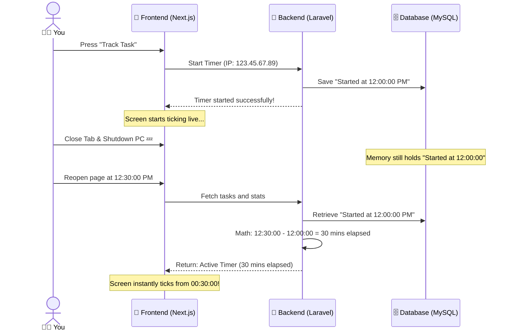

# ⏱️ The Magical Todo & Time Tracker Guide
### (Explained in simple English so even a 10-year-old can understand! 🚀)

Welcome! This guide explains how your new **Todo and Time Tracker** works under the hood. We built it using two friendly computer partners: **Laravel (the backend robot brain)** and **Next.js (the beautiful frontend screen)**.

Let's explore how they talk to each other to make this magic happen!

---

## 🗺️ The Big Picture: How Does it Know Who You Are?

Imagine you walk into a playground. There are no doors, no padlocks, and no passwords. Yet, when you write on a post-it note, only **you** can see it! How?

### 📬 The Mailbox Address (IP Address)
Every computer connected to the internet has a special number called an **IP Address**. It’s like your house's mailbox address. 
* When you add a task or start a timer, our backend robot looks at your request and says: *"Aha! This request came from mailbox `123.45.67.89`. I will only show this task to people at this exact address!"*
* This lets anyone visit your portfolio, add tasks, and track their work privately **without needing to register or log in!**

---

## 🗄️ 1. The Memory Box (The Database)

We have a database, which is like a giant filing cabinet with two drawers:

### Drawer A: `todos` (The Task List)
This drawer stores your Post-it notes. Each file contains:
1. **Title:** What do you need to do? (e.g., *"Clean my room"*).
2. **Completed:** A checkmark (Yes or No).
3. **IP Address:** Which mailbox owns this note?

### Drawer B: `todo_time_tracks` (The Stopwatches)
This drawer stores logs of when you were working on a task. Each time you press "Track", it creates a new log:
1. **Task ID:** Which task is this stopwatch for?
2. **Started At:** The exact second you pressed the Play button.
3. **Stopped At:** The exact second you pressed the Pause button (blank if still running!).
4. **Duration:** How many seconds the stopwatch ticked for.

---

## 🤖 2. The Robot Brain (Laravel Backend)

The backend is like a very organized robot secretary named **PublicTodoController**. Here is what it does when you ask it for things:

### ⏱️ The Infinite Stopwatch Trick (How it ticks when closed!)
You might think: *"If I close the browser tab or turn off my computer, does the stopwatch stop?"*
**No!** 

Here is the secret trick:
1. When you press **Track**, the robot notes down: *"Stopwatch started at 12:00 PM."*
2. You close the tab and go play outside.
3. You come back at 1:00 PM and reopen the page.
4. The robot looks at the clock, sees it is 1:00 PM, and does math: `1:00 PM minus 12:00 PM = 1 hour!`.
5. It tells the frontend screen: *"Hey! The timer has been running for 1 hour. Start ticking from 1 hour!"*

### 🛌 The Sleeping Safety Cap (Auto-Expiration)
What if you start a stopwatch, shut down your computer, and go to sleep for 3 days? We don't want your stopwatch to tick for 72 hours!
* The robot is smart. Next time you open the page, it checks: *"Has this stopwatch been running for more than 8 hours?"*
* If yes, the robot says: *"Oops, they probably fell asleep or turned off their computer! I will stop the stopwatch and cap it at exactly 8 hours so their history stats don't get messy."*

### 🛑 The Shield (Rate Limiting)
To prevent bad robots from spamming your website, we put a shield on the mailbox:
* You can read your tasks up to **60 times a minute**.
* You can click buttons (add, delete, play, pause) up to **15 times a minute**. 
* If you click too fast, the shield blocks you and says: *"Slow down, friend!"*

---

## 🎨 3. The Colorful Screen (Next.js Frontend)

The frontend is the gorgeous page you see when you visit `/todo`. It is built with high-fidelity black and glowing yellow accents. 

Here is what makes it feel alive and premium:

1. **The Live Heartbeat (`setInterval`):** 
   Every second, a tiny clock inside the frontend page ticks. It updates the screen instantly so you see the numbers change (`00:00:58`, `00:00:59`, `00:01:00`) with smooth glowing lights.
2. **The Smart Optimistic Update:** 
   When you press "Delete" or "Complete", the screen doesn't wait for the backend robot to reply. It immediately makes the task disappear or check off! This makes the app feel lightning-fast. If the robot fails to respond, it gently rolls back the change.
3. **The 7-Day History Bars:**
   It draws cute little visual bars for the last 7 days. The longer you worked on a day, the taller and brighter the yellow bar glows!

---

## 🚀 Summary of the Teamwork

And that is how we built a super professional, secure, and beautiful Todo and Time Tracking app! 🌟
